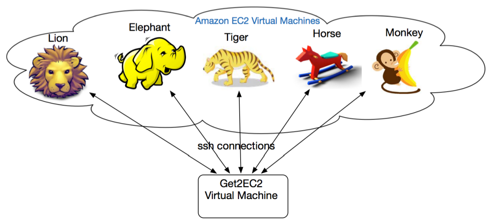
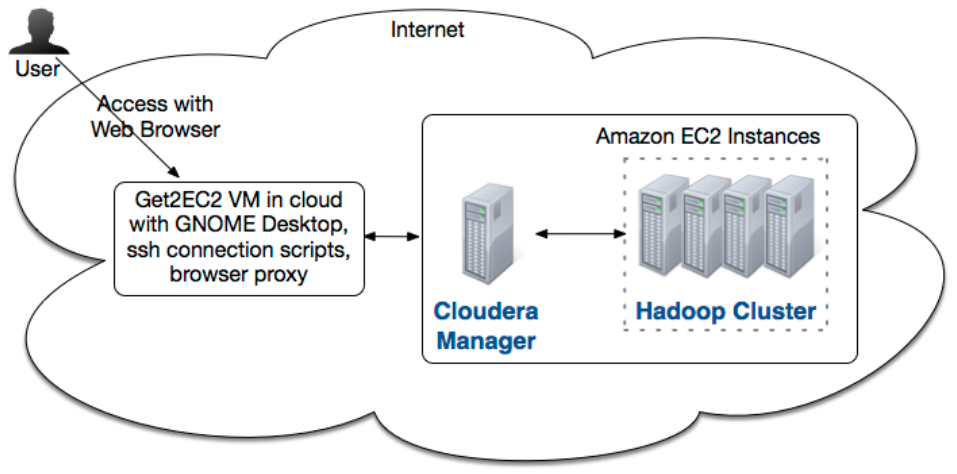

# README

## Cloudera Administrator Training for Apache Hadoop

---

### Overview

This repo contains my detailed notes on On Demand Cloudera Administrator Training for Apache Hadoop hands-on exercises. Topics include:

0. Network Configuration.

---

### Infrastructure Architecture

The infrastructure configuration for this training is as follows:

The cluster planning is as follows:

1. The 'Get2EC2' instance is used as external access point to the cluster.

- Its '/etc/hosts' file contains the **public** IP addresses of all the instances(elephant + tiger, lion, horse & monkey) that will be used for cluster installation.
- It runs the SOCKS5 proxy server for Cloudera Manager web UI access, which is installed on elephant instance.

2. The 'elephant' instance is used by Cloudera Manager and all other instances are used for cluster execution.

- Each instance's '/etc/hosts' and '/etc/sysconfig/network' files contain the **private** IP address of all other instances inside the cluster.
